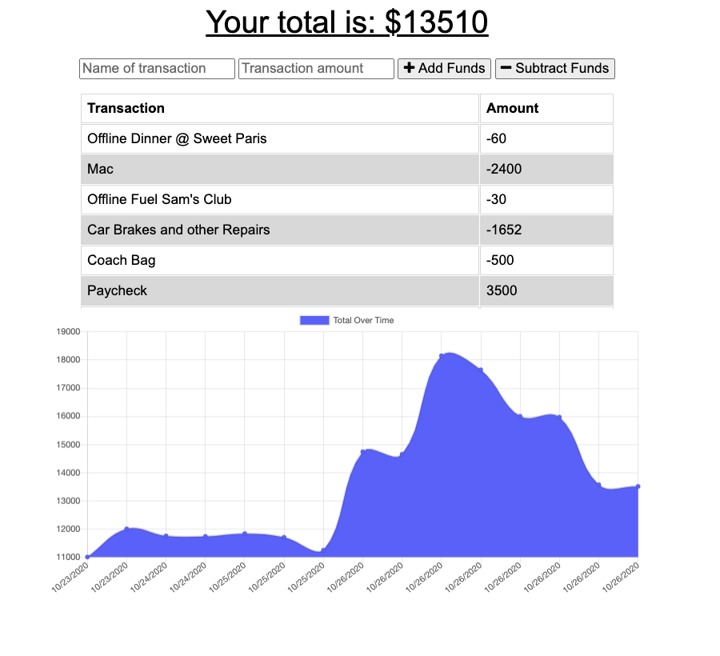

# Budget_Tracker
## Unit 18 PWA Homework: Online/Offline Budget Trackers
<hr> 
<br> 

[](https://opensource.org/licenses/MIT)
[](http://https://github.com/SIROG-E)  
  
## Description
This Budget Tracker application allows the user to add expenses and deposits to their budget with or without a connection. When entering transactions offline, they should populate the total when brought back online.


## Table of Contents
* [Description](#description)
* [Installation](#installation)
* [Usage](#usage)
* [Preview](#preview)
* [Website](#website)
* [License](#license)
* [Contributing](#contributing)
* [Test](#tests)
* [Questions](#questions)
  
## Installation

```
No installation is needed to use this app. 
  ```
`Simply click on ` [here](https://budget-tracker-eg.herokuapp.com/)  ` to start using the app.`

For Developers: After cloning this repo, make sure you run `npm i` to install all dependencies and then `npm start` to view the app on your local port. 
 

## Usage
With this app you can kep track of your expenses even when you have no internet connection.


## Preview
 \
 \

### Website

[Budger Tracker](https://budget-tracker-eg.herokuapp.com/) 

## License
This project is licensed by:\
[](https://opensource.org/licenses/MIT) 

## Contributing
\
[SIROG-E](https://github.com/SIROG-E)

## Test
 

## Questions
If you have any questions, contact SIROG-E at goris.evelyn@gmail.com
  
## Repository
- [GitHub Repo Link](https://github.com/SIROG-E/Budget_Tracker)
  
## GitHub

- Evelyn Goris
- [GitHub Profile](https://github.com/SIROG-E)
- goris.evelyn@gmail.com
